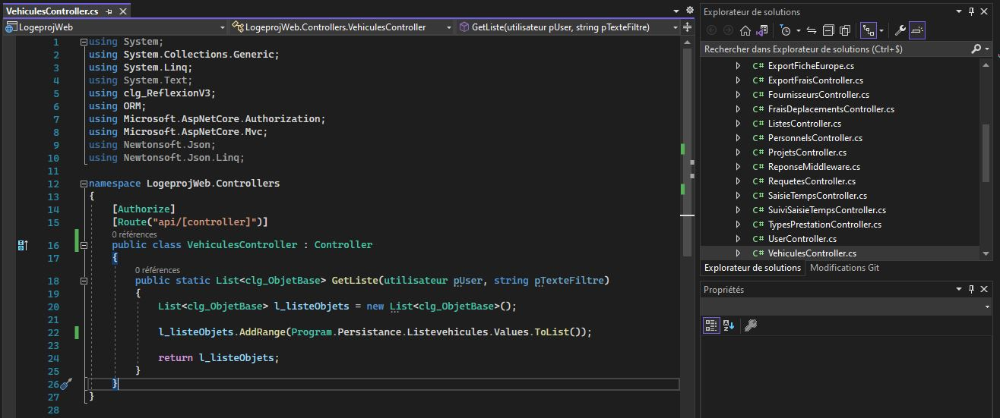
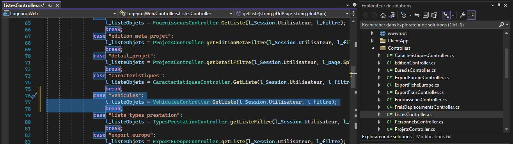

# Ajout et configuration d'un contrôleur 

 
Chaque composant Angular doit disposer côté serveur, d'un contrôleur qui lui est spécifique et qui doit instancier la ou les listes dont on a besoin pour récupérer les bonnes données.
Celui-ci doit également comporter une classe publique portant le même nom que le composant côté client et permettant afin d'être instancié dans un contrôleur global dont le rôle est d'instancier toutes les listes de l'application.

