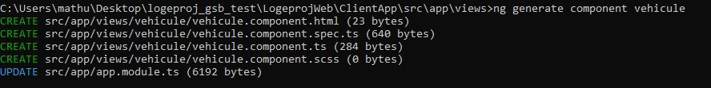

## Création du composant 

 
Pour créer le composant Angular il suffit simplement d'executer la commande ng generate component component-name (ou ng g c) dans le dossier des vues (dossier "views"). Celle-ci va automatiquement créer un nouveau dossier comprenant 3 fichiers :

* __Un fichier HTML (partie graphique)__: nom-composant.component.html
* __Un fichier SCSS (partie graphique)__: nom-composant.component.scss
* __Un fichier TypeScript (partie logique)__: nom-composant.component.ts

