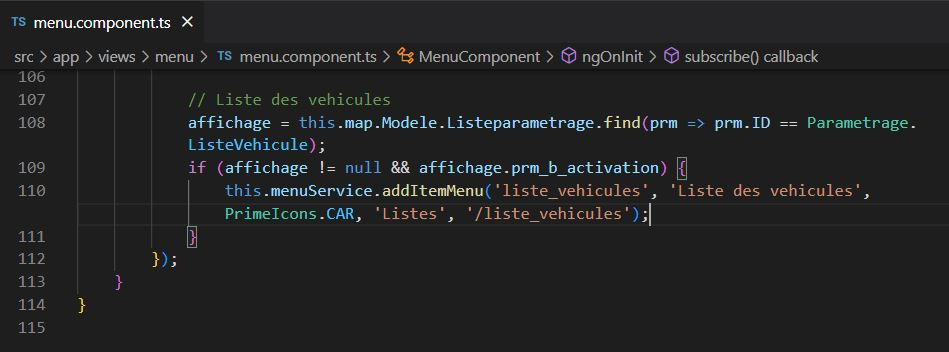

## Création du menu de la nouvelle vue

 
Pour accéder à une vue, il est nécessaire d'avoir un onglet qui permet son affichage. Pour cela il faut ajouter cet onglet en l'ajoutant dans le fichier Typescript correspondant au menu de l'application ("menu.component.ts") comme dans l'image ci-dessous.

