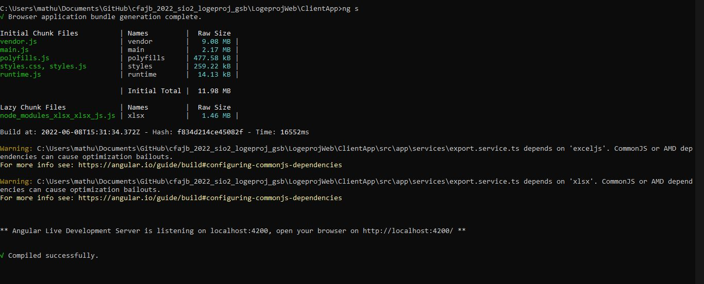

## Lancement du serveur Angular

 
Pour pouvoir accéder à l'application en cours de développement, il est necessaire d'executer le serveur Angular qui a pour but de compiler le code TypeScript en Javscript pour que le navigateur puisse comprendre et executer le code de l'application.

